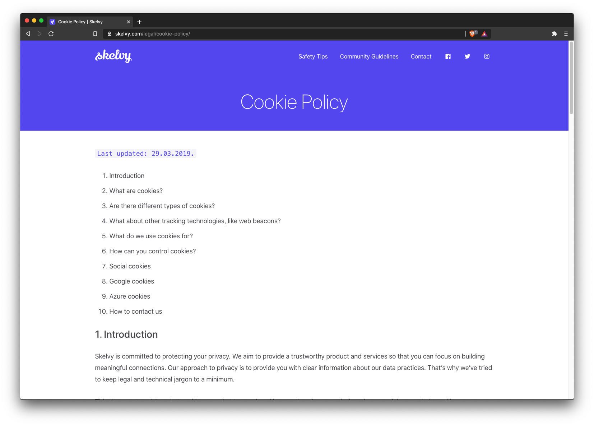

This repository is a part of **skelvy** project. It includes website for mobile app.
Created with php core and wordpress.

There are other parts of the system which are located within different repositories:
- [Web API - ASP.NET Core 3](https://github.com/rafalschmidt97/skelvy-api)
- [Mobile apps (Android and iOS) - Ionic 4 and Angular 8](https://github.com/rafalschmidt97/skelvy-client)
- [Utilities - additinal tools, graphics](https://github.com/rafalschmidt97/skelvy-utilities)

## Tech stack

PHP + WordPress (own theme created from the ground up), Bootstrap 4 + SCSS, Gulp, MySQL (docker), jQuery, languages with pot files, linting and formatting with Prettier and Stylelint, CI with TravisCI.

## Screenshots

You can find more information within [solution description](docs/solution.md).

## Contributing guidelines

We really hope that good instructions for contributing will make the history of our app more readable. 
Take a look [here](CONTRIBUTING.md).

## Development

Current state of development is available to see on [trello](https://trello.com/b/MCzNyRJf).

## Stay in touch

* Website - [skelvy.com](https://skelvy.com/)
* Facebook - [skelvyapp](https://facebook.com/skelvyapp/)
* Twitter - [skelvyapp](https://twitter.com/skelvyapp/)
* Instagram - [skelvyapp](https://instagram.com/skelvyapp/)
* Email - [contact.skelvy@gmail.com](mailto:contact.skelvy@gmail.com)
